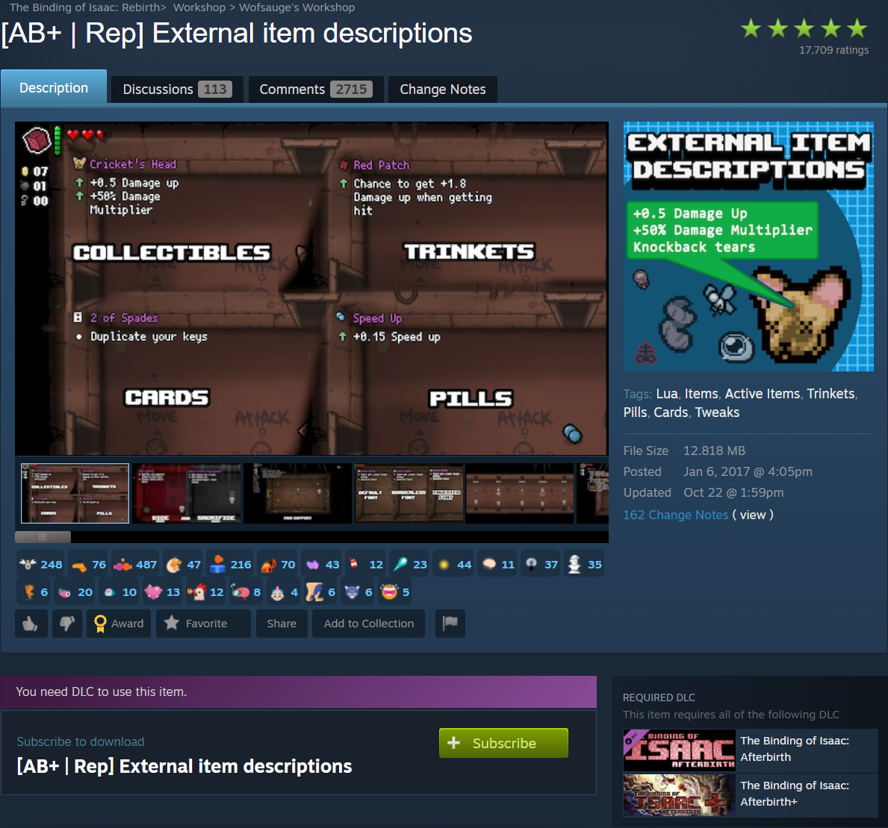

## What are mods?

Mods are fan-made modifications to the game. Some add brand-new content, others add quality of life features, and more. The Binding of Isaac: Rebirth even allows you to progress and save complete objectives while these unofficial modifications are enabled (after completing the first objective without mods).

## Installing mods

Mods are distributed through the [Steam Workshop](https://steamcommunity.com/workshop/), a large collection of community-made mods for various games on Steam. Once you have The Binding of Isaac: Rebirth installed through Steam, installing mods is as simple as finding a mod and clicking a button.

**1. Open the Steam Workshop.**


There are many ways to do this, but the simplest way is to use the link on the game's Library page. From your Library on Steam, the page for The Binding of Isaac: Rebirth has a link to its Steam Workshop page. Click on the Workshop button. It is located beneath and to the right of the play button. 

**2. Find a mod you want to install.**

The Workshop page has many ways to find mods. Popular items are front and center, you can browse by tag, or you could use the search bar to search for specific terms. For the sake of this demonstation, let's download a mod called "External item descriptions" by Wolfsauge. This mod adds detailed descriptions to every item in the game. It's very useful since you don't need to memorize the effects of hundreds of items.

You can locate the mod using the search bar and searching ```[AB+ | Rep] External item descriptions```. You can also follow this [link](https://steamcommunity.com/sharedfiles/filedetails/?id=836319872) to the mod and complete the following steps via a web browser. Just remember to log into your Steam account on your browser.



The mod's page has a variety of information like trailers, screenshots, file size, creator and more. Scrolling down more, you can find more in depth information about the mod and a community comment section.

**3. Make sure you have the required DLC.**


Each mod has a section telling you which DLC you need in order to use the mod. A purple warning tab was show above the Subscribe button, and to the right of that will tell the you required DLC. Assuming you have all DLC, just like the guide, you should not have to worry about this. 

**4. Click subscribe.**

Clicking the green Subscribe button, seen in the example image from step 3, adds the mod to your mod collection and begins downloading the mod. You can check you Downloads on Steam if you want to confirm the download started. 

**5. Boot the game.**

Start playing the game again. You will be greeted by a loading screen detailing the status of the mod you just installed. After downloading and installing, the game's menus will start as normal and you can access the game.

**6. Enable mods.**

While not always necessary, you should make sure to enable mods you have downloaded. Enter a save file and choose the Mod menu.


You will see a list of the mods you have downloaded. For the sake of demonstration, more than one mod has been downloaded. Selecting a mod enables or disables it. Darker text, like "1.!!~External Item Descriptions" means the mod is enabled. Lighter text, like "2.'Enhanced Boss Bars" and "3.Planetarium Chance" means the mods are disabled. Pressing Tab will enable or disable all mods at once. 

And you're finished installing a mod! You can go back to the Steam Workshop and download more, or start playing.
