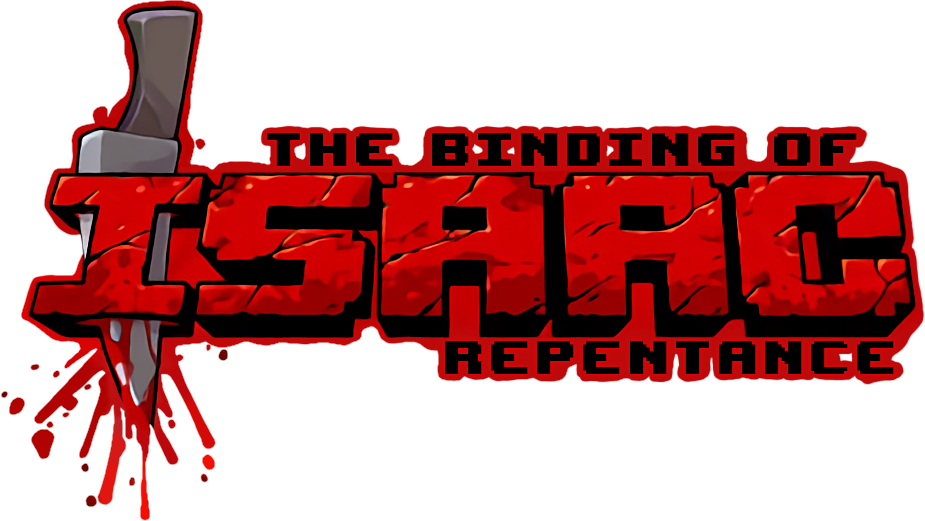
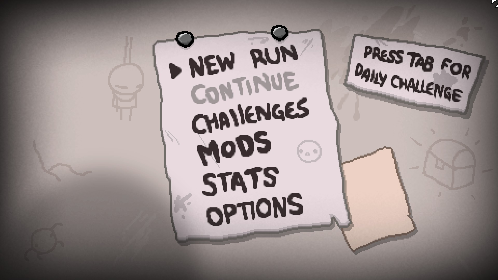
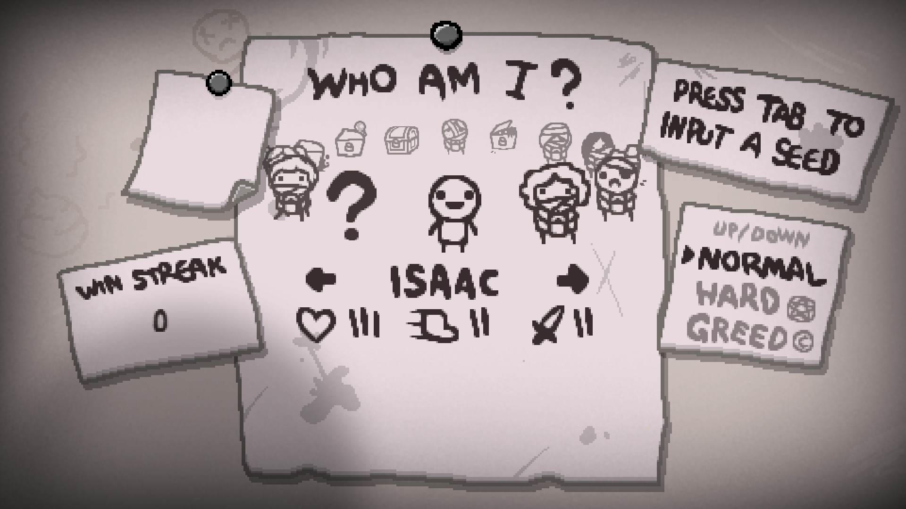
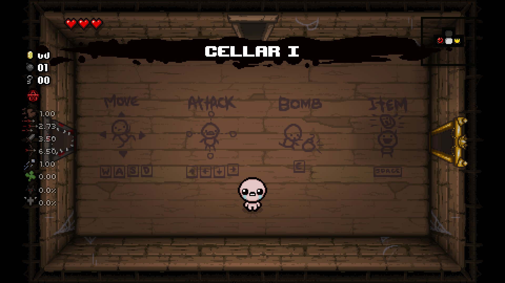

### Introduction 
This website will cover the basics of The Binding of Isaac: Repentance, as well as how to install mods. Content warning: The Binding of Isaac: Rebirth is rated M by the ESRB for violence, blood and gore, and crude humor. 

## What is The Binding of Isaac: Repentance?

The Binding of Isaac: Repentance is the latest expansion for The Binding of Isaac: Rebirth, a top-down action rogue-like shooter that follows the main character Isaac's bizarre and disturbing adventure down his toychest. Much of the information on this website will show images and data from the Repentance expansion, however most information will still be releveant to the base-game and its other expansions. The version used is the Steam version of the game for PC and Mac, [available here](https://store.steampowered.com/app/250900/The_Binding_of_Isaac_Rebirth/).

### Getting Started

**Controls disclaimer**

Controls used for this tutorial will be the default set by the game.

**Menus**



Upon booting up the game, you will find yourself looking at the title screen. Press the Spacebar or Enter key, and choose a save file on the next screen. After choosing a file, you will see a list of menus to choose from. 

- _New Run_ allows you to start a new run, a run being another playthrough of the game.

- _Continue_ allows you to continue your last run if you quit before finishing or losing. It may be greyed out if there is no saved run.

- _Challenges_ are pre-set runs where you start with specific items, character and have an objective. Completing Challenges unlocks new items. Unlock more Challenges by unlocking more items in runs.

- _Mods_ allows you to tune the functionality of some mods, such as enabling or disabling them. This is only in the PC version of the game. 

- _Stats_ shows you the statistics of your old runs, such as wins losses, what enemies you have faced, etc.

- _Options_ allows you to configure various things such as graphics, controls, and more. 

You can also press Tab to participate in Daily Runs, where you compete on a pre-set run for the highest score on a leaderboard.

**Character Select and Game Modes**



This menu allows you to choose a character to play as. Each character has different stats and some even hold items to start a run with. Isaac is unlocked by default, and other characters can be unlocked by meeting the conditions specified while they are selected. There are 3 different gamemodes available immediately.

- _Normal_ is the normal gamemode, the objective is to explore and complete each floor without losing all your health and eventually defeat the final boss of the run.

- _Hard_ is similar to Normal mode, except there are various changes to make it more difficult. Clearing rooms results in fewer clear rewards,, enemies are more powerful, the floors are larger, and more. You can also unlock more items and other things when playing on Hard compared to Normal.

- _Greed_ tasks you with defeating waves of enemies for money. The money then can be spent on items to help with later enemies and floors. This mode also has a unique final boss and unlocks.

**Other UI Elements**

- _Win Streak_ is the amount of times in a row you have finished a run without dying.

- _Completion Marks_ are on the post-it note to the left of the character select menu. The post-it note will have symbols on it which represent which objectives they completed. Each character has their own Completion Marks, so you must complete all the objectives with all characters if you wish to achieve 100% completion.

- _Press Tab To Input A Seed_ is a menu that can be accessed after pressing Tab. Once inside the menu, strings of numbers and characters can be input to influence the generation of the next run. Many of these "seeds" prevent objectives from being counted and items from being unlocked. For a full list of seeds, visit [the wiki](https://bindingofisaacrebirth.fandom.com/wiki/Seeds).

And with that, you can start playing! Once in a run, the game does not tell you much about what to do, what item types do what, secrets, and more. For tips and information on items, attributes and more, the <a href="tipsandtricks.html">Tips and Tricks page</a>. For information about mods, visit the <a href="Mods.html">Mods page</a>.

  
### ANNNNND PAGE WILL END HERE. I'M NOT DELETING IT YET SINCE IT MIGHT HAVE SOME USEFUL INFORMATI0N.
  
```markdown
Syntax highlighted code block

# Header 1
## Header 2
### Header 3

- Bulleted
- List

1. Numbered
2. List

**Bold** and _Italic_ and `Code` text

[Link](url) and 
```

For more details see [GitHub Flavored Markdown](https://guides.github.com/features/mastering-markdown/).

### Jekyll Themes

 <a href="Mods.html">Mods</a>

Your Pages site will use the layout and styles from the Jekyll theme you have selected in your [repository settings](https://github.com/elliottim/elliottim.github.io/settings/pages). The name of this theme is saved in the Jekyll `_config.yml` configuration file.

### Support or Contact

Having trouble with Pages? Check out our [documentation](https://docs.github.com/categories/github-pages-basics/) or [contact support](https://support.github.com/contact) and we’ll help you sort it out.
