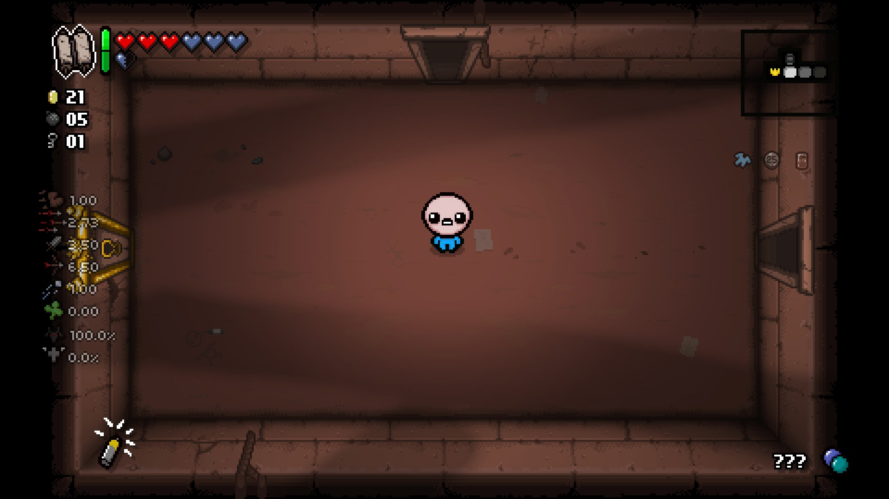
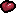
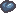
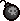
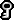
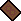
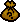

## Tips & Tricks

### Controls

Controls used for this tutorial will be the default mouse and keyboard controls.

- *WASD keys* are used for movement.

- *Arrow keys* are used to shoot in the direction held.

- *E* is used to place bombs.

- *Spacebar* is used to active an Item.

- *Q* is used to activate and consume pills and cards.

- *L CTRL* is held to drop trinkets and pickups.

- *Tab* enlarges or shrinks the map.

- *F* toggles fullscreen mode.

- *R* is held to restart runs.

- *M* is used to mute the game.

- *ESC or P* are used to pause the game.

### HUD Elements

The UI is found surrounding the edges of the screen.

- *Items* are located on the top left. The greenbar represents how much charge the item has. A full green bar means the item can be used.

- *Health* is located on the top left to the right of items, and can be made of many types of hearts.

- *Coins, Bombs, and Keys* are located to the left beneath your Item. Coins can be used to buy things from the shop or give to Beggars, Bombs are used to blow up objects and enemies, and Keys are used to open locked chests and doors.

- *Attributes* are located on the left side of the screen in a list fashion. This is an option called the Found Hud added with the Afterbirth+ DLC. Attributes can also be found on the pause menu.

- *Trinkets* are located on the bottom left.

- *The Map* is located on the top right.

- *Passive Items* you have collected are located on the right below the map.

- *Cards and Pills* are located on the bottom right. Cards and Pills are a special type of pickups which can be carried and used when you like. 

### Attributes

In the image above, Attributes top to bottom are:

- *Speed*: Displays the movement speed.

- *Tears*: Displays speed of shooting tears.

- *Damage*: Displays the damage done per tear.

- *Ramge*: Displays how far tears will travel.

- *Shot speed*: Displays how fast tears travel.

- *Luck*: Displays luck used in certain calculations.

- *Devil Chance*: Displays the chance for a Devil Room to appear at the end of a floor.

- *Angel Chance*: Displays the chance for an Angel Room to appear at the end of a floor.

Using pickups and obtaining Passive Items can improve attributes permanently, while using Items and holding Trinkets improve attributes temporarily.

Devil Chance and Angel Chance are determined uniquely compared to other attributes. Devil Chance is determined per-floor and it is lowered by taking damage to your red health. Angel Chance is determined after you do not enter Devil Rooms on a floor. Angel Chance also lowers if you take damage to your read health. 

### Pickups

-   *Hearts* refill your health or add an extra layer of protection which cannot be replenished.

-  *Coins* add to your money count. There are many types of coins worth different amounts. 

-  *Bombs* add to your bomb count. They can be used to blow things up and hurt enemies.

-  *Keys* add to your key count. They are used to open locked chests and doors.

-  *Batteries* are used to refill your Item charge bar instead of charging the bar manually. There are many sizes of batteries.

-  *Pills* are consumable pickups which are held. They provide a random effect, sometimes good, sometimes bad.

-  *Cards* are consumable pickups which are held. They activate a wide range of temporary effects.

-  *Bags* spawn many other pickups when collected.

### Miscellaneous Tips

- You can curve your tears and effect their range by moving while shooting. Try moving perpendicular to where you are shooting to hit an enemy hiding behind a rock.

- You can unlock items by giving Coins to the large machine in Shops. You can each take money back out by blowing up the machine with Bombs. 

- Be careful not to hurt yourself with bombs or Items. 

- *Secret Rooms* are rooms not shown on the map. Specific walls must be blown up by bombs for them to open. Each floor has 1 Secret Room and 1 Super Secret Room. In order for a Secret Room to generate, a room must not prevent the player from being able to access where they must blow up the wall. Secret Rooms are adjacent to at least 2 rooms, and Super Secret Rooms are only adjacent to 1 room.

- *Rocks and Poop* can be used to make bridges over gaps. If there is a rock or poop adjacent to a hole, try blowing it up with a bomb to make a bridge. 

- *Tinted Rocks* are special rocks which have an X mark on them and are slightly off color. While hard to spot, these rocks give rewards for being blown up.
